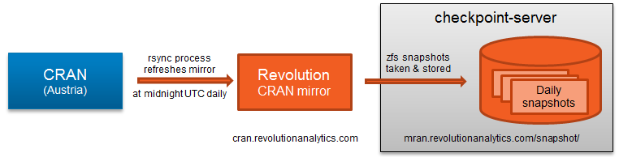
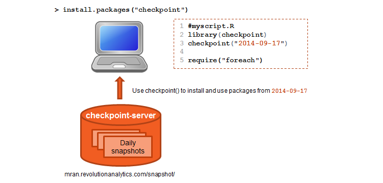
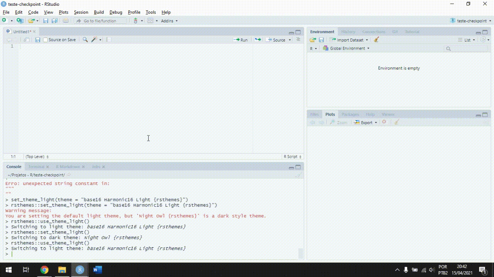

```{r setup, include=FALSE, eval=TRUE}
options(htmltools.dir.version = FALSE)
knitr::opts_chunk$set(
	eval = FALSE,
	fig.align = "center",
	message = FALSE,
	warning = FALSE
)
```

```{r eval = TRUE, echo = FALSE}
library(xaringan)
library(xaringanExtra)
library(xaringanthemer)
library(emo)
```


```{r xaringanExtra, include=FALSE, eval=TRUE}
xaringanExtra::use_tile_view()
xaringanExtra::use_clipboard()
xaringanExtra::use_extra_styles(hover_code_line = TRUE,
                                mute_unhighlighted_code = FALSE)
```


## Reprodutibilidade

Muitas das nossas análises no `R` envolvem funções de diferentes pacotes (e.g., `car`, `dplyr`, `ggplot2`).

Pacotes são atualizados constantemente.

Para garantir resultados **reprodutíveis**, é importante rodarmos as análises com as mesmas versões de pacotes de quando os códigos foram escritos.

Com esse objetivo, foi criado o pacote [`checkpoint`](https://cran.r-project.org/web/packages/checkpoint/vignettes/checkpoint.html).

---

## `checkpoint`

Criado pelo Reproducible R Toolkit (RRT), o pacote `checkpoint` possui uma única função: `checkpoint()`.

Essa função instala os pacotes utilizados nos scripts de acordo com alguma data específica (e.g., 2021-01-01).

Isso facilita a reprodução dos códigos e resultados.
 

---

## *Checkpoint server*

O [checkpoint server](https://github.com/RevolutionAnalytics/checkpoint-server) armazena cópias diárias do CRAN (i.e., repositório de pacotes do R).

1. Snapshots diários do CRAN são armazenados no *checkpoint server*.

2. O pacote `checkpoint` acessa o *checkpoint server* e busca pelo snapshot do CRAN do dia desejado.

3. Encontrado o snapshot do dia desejado, o `checkpoint` estará pronto para fazer o download dos pacote utilizados nos códigos.

P.S.: O mais antigo snapshot disponível é de `2014-09-17`.

---

<br>
<br>
<br>


```{r echo = FALSE, eval = TRUE, out.width="100%", fig.cap="Checkpoint server"}

```


---


## Como funciona o pacote `checkpoint`

`checkpoint` permite instalar pacotes como eles eram em uma data específica.

Utiliza os snapshots armazenados no *checkpoint server*.

A sessão do `R` também é modificada para que os pacotes sejam usados corretamente.

`checkpoint` e *checkpoint server* são como uma **máquina do tempo** para garantir a reprodutibilidade das análises.

---

<br>


```{r echo = FALSE, eval = TRUE, out.width="100%", fig.cap="Checkpoint package"}

```


---

class: inverse, center, middle

# Usando o `checkpoint`

---

name: checkpoint

## Função `checkpoint()`

Vamos começar criando um `R project` chamado my-project.

P.S.: Caso você não saiba como criar um projeto, [clique aqui](#projeto).

--

No projeto, crie um novo `R script` com:

- `File` --> `New File` --> `R script`, ou

- `Ctrl(Cmd) + Shift + N`

---

Nesse `R script`:

```{r echo = TRUE, eval=FALSE}
install.packages("checkpoint")
library(checkpoint)
```

Defina uma data (formato "YYYY-MM-DD") e use a função `checkpoint()`:

```{r echo = TRUE, eval = FALSE}
my_date <- "2020-05-01"
checkpoint(my_date)
```


--

O `checkpoint` escaneou o `R project`, mas nenhum pacote foi encontrado, uma vez que nenhum pacote foi utilizado.

---

Vamos usar a função `library()` **sem executá-la** para inserirmos dois pacotes no script:


```{r echo = TRUE, eval = FALSE}
library(checkpoint)
my_date <- "2020-05-01"
checkpoint(date)

library(dplyr)
library(ggplot2)
```

Se executarmos o `chechpoint()` agora, veremos que dois pacotes serão encontrados (i.e., `dplyr` e `ggplot2`) e instalados na versão que eles eram no dia `"2020-05-01"` (i.e., `3.3.0` e `0.8.5`).

---

Além de instalar os pacotes encontrados no `R project`, o `checkpoint` mudou o caminho para a pasta usada pelo `R` para encontrar e carregar os pacotes.

Você pode checar isso por meio da função `.libPaths()`.

Agora, podemos executar a função `library()` e os pacotes serão carregados na versão desejada.

Para interromper o uso do `checkpoint`, *restart* a sessão do R (e.g., `Ctrl + Shift + F10`).


---

### Recap

Quando você cria um *checkpoint*, a função `checkpoint()`:

- Cria uma pasta `~/.checkpoint/YYYY-MM-DD` para armazenar os pacotes que serão instalados.

- Escaneia todos os scripts armazenados na pasta do projeto em busca dos pacotes utilizados.

- Instala esses pacotes a partir do snapshot do dia especificado.

- Modifica o caminho para a pasta usada pelo `R` para encontrar e carregar os pacotes.

---

Caso você queira carregar um pacote que ainda não foi instalado, coloque `library(nome_do_pacote)` no script e execute a função `checkpoint()` novamente.

P.S.: Se você executar o `library(nome_do_pacote)` antes de executar a função `checkpoint()`, o `R` não encontrará o pacote.

```{r eval=FALSE, echo = TRUE}
library(checkpoint)
my_date <- "2020-05-01"
checkpoint(my_date)

library(dplyr) # ok
library(ggplot2) # ok
library(forcats) # novo pacote, precisa executar checkpoint(my_date) novamente

```

---

### Trabalhando com vários scripts

Se apenas um `R script` é o suficiente para armazenar todo o seu código, use o `checkpoint` no topo do código:

```{r eval=FALSE, echo = TRUE}
# data analysis

# checkpoint
library(checkpoint)
my_date <- "2020-05-01"
checkpoint(my_date)

# libraries
library(ggplot2)
library(dplyr)
library(car)

# analysis
my_data <- mtcars
summary(my_data)
my_plot <- my_data %>% ggplot(aes(mpg, hp)) %>% geom_point()
```


---

Se você utilizar diversos `R scripts`, você pode criar um `R script` apenas para o `checkpoint`:

```{r eval=FALSE, echo = TRUE}
# checkpoint script

library(checkpoint)
my_date <- "2020-05-01"
checkpoint(my_date)
````

**P.S.:** Esse `R script` deve ser executado sempre que você for trabalhar nesse projeto.

Mesmo que nenhum pacote tenha sido adicionado, a função `checkpoint()` mudará o *caminho* para a pasta com as versões apropriadas dos pacotes.

---

### Compartilhando seu código

Compartilhar códigos de análises com colegas ou com o mundo (*open science!*) é uma prática crescente e necessária.

É recomendável compartilhar todo o projeto (i.e., a pasta com todos os arquivos e o `.Rproj`), uma vez que as pessoas terão acesso a todos os arquivos em um só lugar.

Como boas práticas, crie um arquivo **README** com informações sobre o trabalho e aproveite para informar as pessoas sobre o `checkpoint` e como/porque utilizá-lo.

Caso você apenas queira compartilhar um `R script`, lembre-se de inserir as linhas de código para executar o `checkpoint` no início.

---

## Referências

- Para mais informações sobre o pacote `checkpoint`, acesse a [*vignette* do pacote](https://cran.r-project.org/web/packages/checkpoint/vignettes/checkpoint.html).

- Os slides foram criados com:

  - [Rmardown](https://rmarkdown.rstudio.com/);
  
  - [xaringan](https://slides.yihui.org/xaringan/), [xaringanthemer](https://pkg.garrickadenbuie.com/xaringanthemer/index.html) e [xaringanExtra](https://pkg.garrickadenbuie.com/xaringanExtra/#/README?id=xaringanextra).
  

- O pacote [`groundhog`](http://groundhogr.com/) também pode ser uma opção para controlar a versão dos pacotes e aumentar a reprodutibilidade dos códigos.

---

class: inverse, middle, center

# Obrigado!

<br>

`r emo::ji("email")` [diegogaldinof@gmail.com](mailto:diegogaldinof@gmail.com)

---

name: projeto

## Criando projeto no RStudio

Criar um projeto no RStudio é fácil e extremamente importante para mantermos nossos códigos organizados.

Um projeto é uma **pasta** que armazenará scripts, bancos de dados, gráficos, objetos e arquivos referentes ao seu trabalho.

Dentro dessa pasta, será criado um arquivo `.Rproj`, que indicará ao R que o ambiente de trabalho deverá ser esse projeto.

Com o projeto aberto no RStudio, tudo o que você salvar (e.g., scripts) será armazenado na pasta do projeto.

---

Para criar um projeto:


`File` --> `New Project...` --> `New Directory` --> `New project`

No campo `Directory name`, digite um nome para o seu projeto e clique em `Create New Project`.

Veja o exemplo no próximo slide.

---


```{r eval = TRUE, echo = FALSE, out.width="90%"}

```


.footnote[
[Voltar para o slide que você parou](#checkpoint)
]


